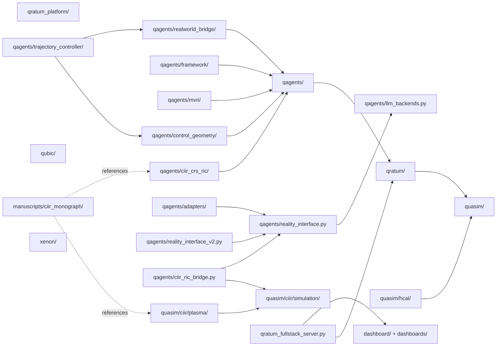
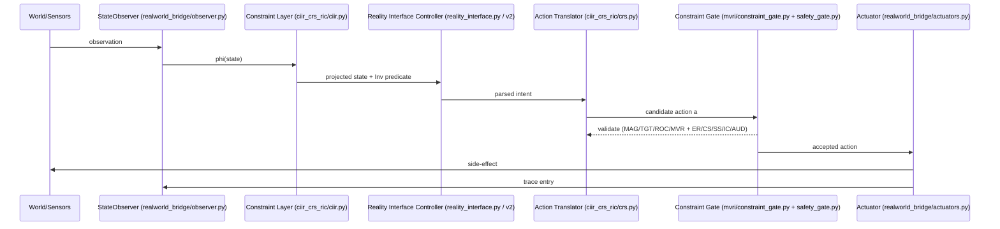
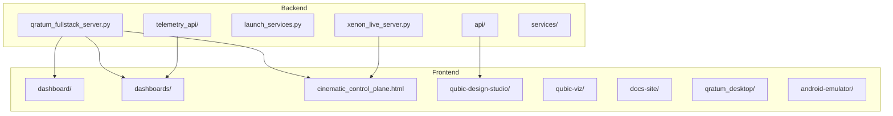
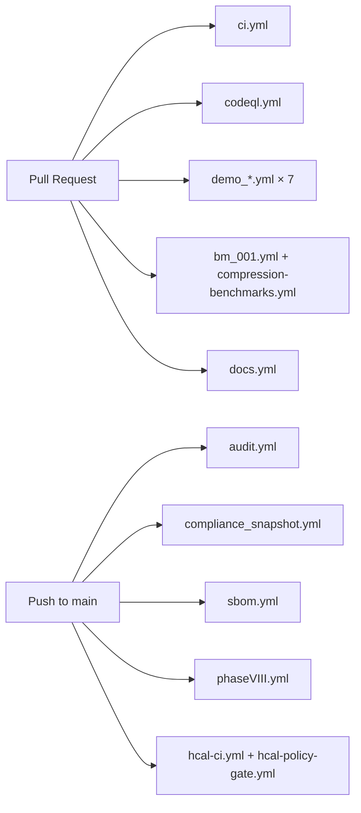
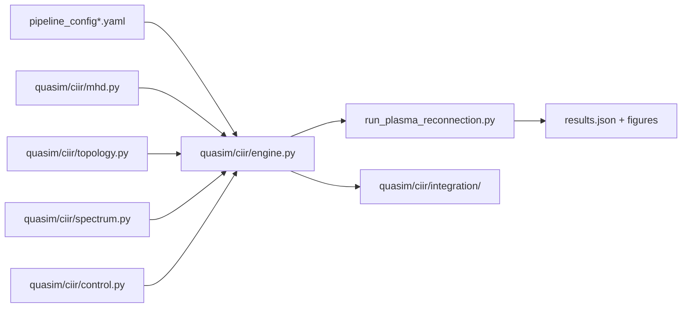

# QRATUM Unified Architecture (As-Is)
_Commit_: `8fc58a9107334a3b53b69a47580df64b185d3317`  _Generated_: 2026-04-29T22:27:58Z

## Top-Level Module Graph (subset of 3991 files, 200 sample edges)

## CIIR–CRS–RIC Closed Loop (verified present)

## Frontend ↔ Backend Seams

> **Seam audit caveat:** route↔consumer matrix (`audit/seams/api_matrix.csv`) is generated by static
> string scan of `@app.route`, `@router.`, `socket.on`, `fetch(`, `axios.`, `EventSource`, etc.;
> dynamic / templated routes are not resolved.

## CI/CD Pipeline

(Total workflows: 56; see `audit/cicd/matrix.csv`.)

## Simulation Engine Dataflow (QuASIM × CIIR)

