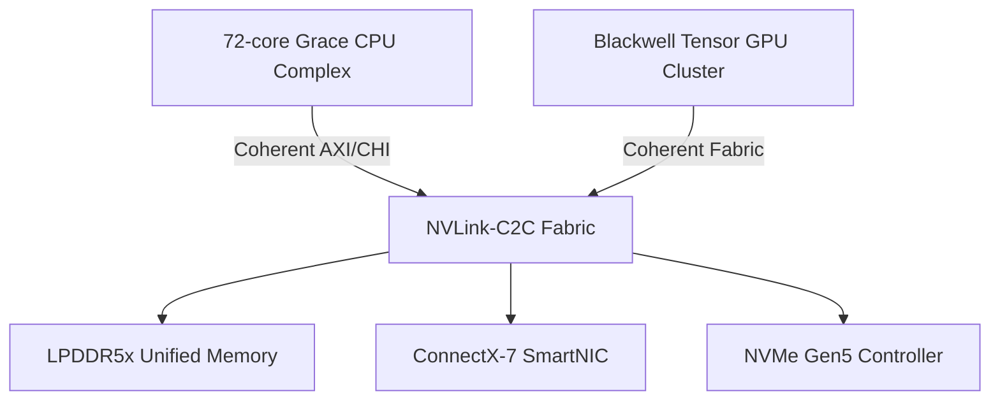

# Architecture Overview

The GB10 superchip couples a high-core-count Grace-inspired CPU complex with a Blackwell-style GPU cluster through a coherent NVLink-C2C fabric. The CPU delivers Arm v9 SVE2 compute with advanced power-state management, while the GPU exposes SIMT scheduling, 5th generation tensor cores, and ray-tracing acceleration.

The unified fabric allows every agent to operate in a shared virtual address space, enabling low-latency data exchange between AI and quantum simulation workloads.
