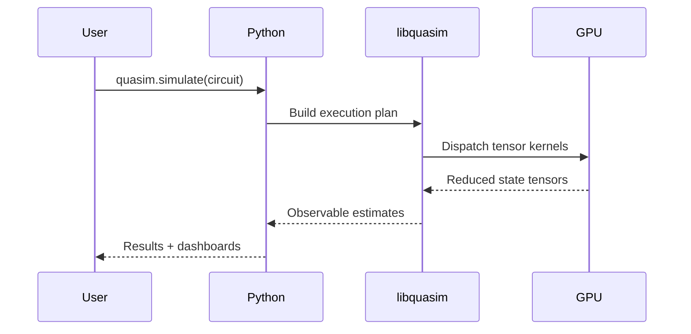

# QuASIM Integration

The QuASIM runtime layers quantum circuit simulation on top of GPU tensor primitives. The workflow integrates with cuQuantum to accelerate tensor-network contraction.

1. **Circuit Capture** — The Python API accepts circuits from JAX or PyTorch modules and lowers them to the QuASIM IR.
2. **Tensor Planning** — `libquasim` inspects the circuit graph and partitions it into contraction stages, emitting asynchronous command lists for the GPU tensor cores.
3. **Hybrid Scheduling** — NVLink-C2C coherency allows CPU and GPU to collaborate. Classical pre-processing runs on the Grace cores while the GPU executes contraction kernels.
4. **Measurement & Visualization** — Results stream into the visualization toolkit built with Plotly, enabling real-time dashboards across Kubernetes clusters.

The design maintains API parity with CUDA 12.x to simplify migration from NVIDIA-accelerated stacks while delivering synthetic open implementations.
