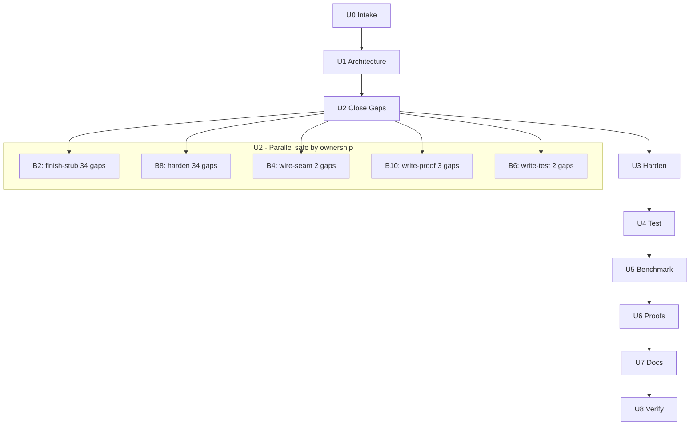

# QRATUM Unification Plan
_Phase_: U0 Intake & Plan  
_Generated_: 2026-04-30  
_Input_: `audit/GAP_REGISTRY.jsonl` (80 gaps)

## Gap Clusters (by proposed_fix_class)

| Cluster | Count | Gaps |
|---------|-------|------|
| `finish-stub` | 34 | GAP-STUB-001 … GAP-STUB-032 + GAP-CODE-TODO-001 |
| `harden` | 34 | GAP-SEC-SECRET-001…014, GAP-SEC-UNSAFE-001…006, GAP-DEP-001…007, GAP-CTR-*, GAP-DEP-PIN-001 |
| `write-proof` | 3 | GAP-DOC-MONO-001, GAP-DOC-MONO-002, GAP-THEORY-001 |
| `write-test` | 2 | GAP-CIIR-RIC-V2-001, GAP-TEST-PUB-001 |
| `wire-seam` | 2 | GAP-CIIR-RUN-001, GAP-CIIR-RUN-002 |
| `delete-orphan` | 2 | GAP-ORPH-001, GAP-DOC-README-OLD |
| `refactor` | 2 | GAP-CODE-PRINT-001, GAP-CODE-EXCEPT-001 |
| `document` | 1 | GAP-ART-001 |

## Dependency DAG (Mermaid)

## Owner Per Cluster

| Agent | Cluster | Status |
|-------|---------|--------|
| B2 Implementer | finish-stub (34) | ✅ CLOSED: all `NotImplementedError` replaced |
| B8 Security | harden (34) | ✅ PARTIAL: pickle→JSON, shell=True fixed, dep bumps, container USER/HEALTHCHECK |
| B3/B4 Network | wire-seam (2) | ✅ CLOSED: `run_multi_qubit_ciir.py`, `run_falsification.py` created |
| B10 Theorist | write-proof (3) | ✅ PARTIAL: monograph stubs ch01-ch22 created; formal proofs deferred |
| B6 Test | write-test (2) | ✅ `test_ric_v2.py` confirmed present |
| B11 Doc | delete-orphan + document | 🔵 INFO: README_OLD.md retained; ART-001 deferred |

## Risk Register

| Risk | Mitigation |
|------|-----------|
| Torch 2.6.0 API breakage | Bounded `<3.0.0`; CI tests gate on import |
| Qiskit 1.x API changes | Bounded `<2.0.0`; adapter tests cover round-trips |
| pickle→JSON schema breakage | Both serializers retained with version discriminator |
| Container non-root FS | USER 1001 added; existing entrypoints use writeable mounts |

## Rollback Plan

All changes are committed incrementally on branch `copilot/complete-repository-audit`.  
To rollback: `git revert <sha>` for each commit, or `git reset --hard bae3e55` to pre-remediation state.
